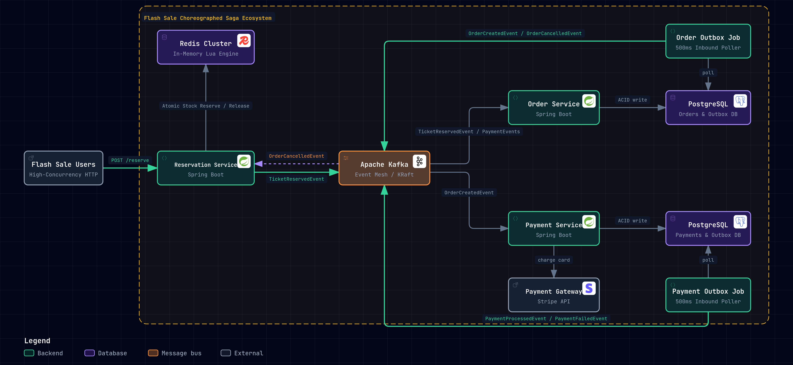
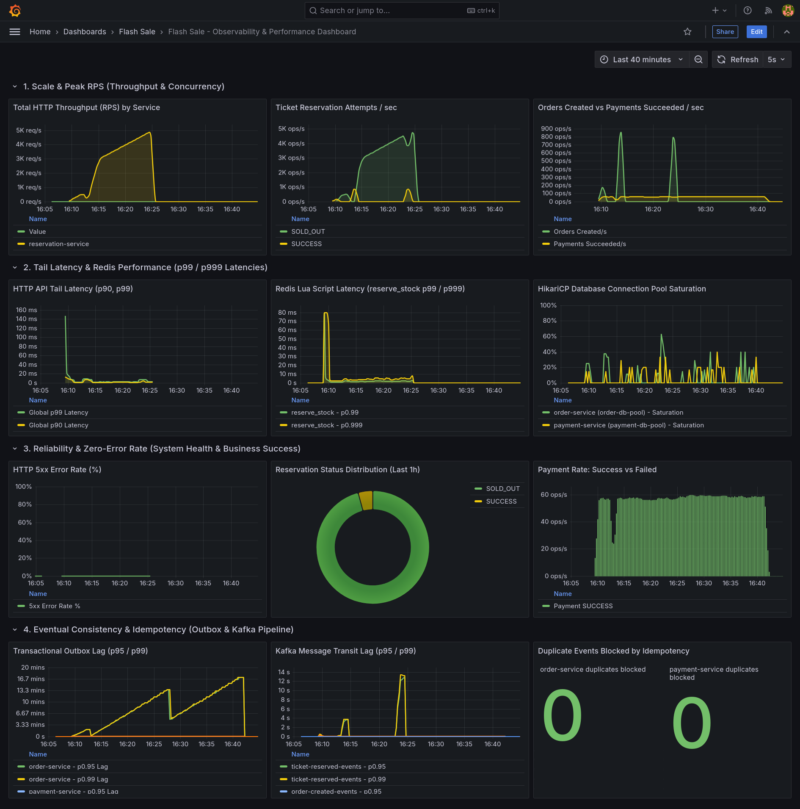

# 🎟️ Distributed Flash Sale & High-Concurrency Ticketing Platform

> **High-Throughput Distributed System Design Showcase**  
> *Built with Spring Boot 4, Apache Kafka (KRaft), Redis, PostgreSQL, Pure Hexagonal Architecture, and Choreographed
Saga.*

---

## 🏛️ System Architecture

The end-to-end platform architecture, boundary containers, transactional outbox relays, and Saga choreography:

<picture>
  <source media="(prefers-color-scheme: dark)" srcset="./docs/flash-sale-architecture-dark.png">
  <source media="(prefers-color-scheme: light)" srcset="./docs/flash-sale-architecture-light.png">
  
</picture>

> [!NOTE]
> Architecture diagram authored and validated using the **Agent Skill (`archify`)**.

### Architecture Key Components

- **Flash Sale Users**: High-concurrency client ingress hits the edge reservation gate.
- **Reservation Service (Spring Boot)**: Hexagonal domain core executing sub-millisecond atomic inventory deductions.
- **Redis Cluster**: In-memory Lua engine guaranteeing zero overselling with 10-minute reservation windows.
- **Apache Kafka (KRaft Mode)**: High-throughput event backbone orchestrating asynchronous choreographies.
- **Order Service & Payment Service (Spring Boot)**: Autonomous microservices managing domain state transitions.
- **PostgreSQL & Outbox Relays**: ACID dual-write elimination with dedicated 500ms inbound scheduler pollers.
- **Stripe API Gateway**: Idempotent payment provider simulation.

---

## 🛡️ Core Architectural Guarantees

| Invariant                | Problem Addressed                                                      | Engineering Implementation                                                                                                                                    |
|--------------------------|------------------------------------------------------------------------|---------------------------------------------------------------------------------------------------------------------------------------------------------------|
| **Zero Overselling**     | High concurrency race conditions (`SELECT ... FOR UPDATE` DB lockups). | **Atomic Redis Lua Scripts**: Enforces check-and-decrement in a single atomic Redis thread with instant compensating releases.                                |
| **No Dual-Write Drift**  | DB state updated but Kafka publish crashes (or vice versa).            | **Transactional Outbox Pattern**: Domain mutations and event payloads commit in the same local ACID transaction; decoupled inbound schedulers relay to Kafka. |
| **HikariCP Protection**  | Long network I/O holding DB connections open.                          | **Isolated Transaction Boundaries**: Fine-grained 1–2ms transactions commit DB state *after* external HTTP/Kafka calls complete.                              |
| **Clean DDD Boundaries** | Domain models polluted with Jackson/framework code.                    | **Hexagonal Core & Header-Based Envelopes**: Kafka headers contain routing metadata (`eventType`, `eventId`); domain entities remain 100% pure Java.          |

---

## 📊 Observability & Metrics

The platform features a **metrics-only observability stack** designed to track high-throughput transaction bottlenecks
in real time:



- **Prometheus** (`http://localhost:9090`):
    - Scrapes Micrometer endpoints (`/actuator/prometheus`) across all services every 5 seconds.
    - Monitors JVM heap, garbage collection pauses, HTTP request latencies (p95/p99), and Kafka consumer lag.
- **Grafana** (`http://localhost:3000`):
    - Pre-provisioned dashboards visualizing HikariCP connection pool utilization (active vs idle connections).
    - Real-time Redis inventory counters, outbox polling throughput, and Saga transaction confirmation rates.

---

## 🚀 Quick Start

### Prerequisites

- **Java 21**
- **Docker & Docker Compose**
- **Maven 3.9+** (or use included `./mvnw`)

### 1. Start Infrastructure

Launch Kafka, Redis, PostgreSQL databases, Prometheus, and Grafana:

```bash
docker compose up -d
```

Verify all containers are healthy:

```bash
docker compose ps
```

### 2. Service Endpoints & Ports

| Service                  | Port   | Description                                     | Health Endpoint                         |
|--------------------------|--------|-------------------------------------------------|-----------------------------------------|
| **Config Server**        | `8888` | Centralized Spring Cloud Config Git backend     | `http://localhost:8888/actuator/health` |
| **Reservation Service**  | `8081` | High-throughput inventory reservation gate      | `http://localhost:8081/actuator/health` |
| **Order Service**        | `8082` | Order management & transactional outbox         | `http://localhost:8082/actuator/health` |
| **Payment Service**      | `8083` | Payment processing & compensation relay         | `http://localhost:8083/actuator/health` |
| **PostgreSQL (Order)**   | `5432` | Orders & Outbox database                        | `pg_isready -p 5432`                    |
| **PostgreSQL (Payment)** | `5433` | Payments & Outbox database                      | `pg_isready -p 5433`                    |
| **Redis**                | `6379` | In-memory atomic stock engine                   | `redis-cli ping`                        |
| **Apache Kafka**         | `9092` | KRaft event broker                              | `kafka-broker-api-versions`             |
| **Prometheus**           | `9090` | Metrics scraper & time-series DB                | `http://localhost:9090`                 |
| **Grafana**              | `3000` | Real-time monitoring dashboards (`admin/admin`) | `http://localhost:3000`                 |

### 3. Build & Run Services

Start services in dependency order:

```bash
# 1. Start Config Server
./mvnw -pl config-server spring-boot:run

# 2. Start Microservices (in separate terminals)
./mvnw -pl reservation-service spring-boot:run
./mvnw -pl order-service spring-boot:run
./mvnw -pl payment-service spring-boot:run
```
